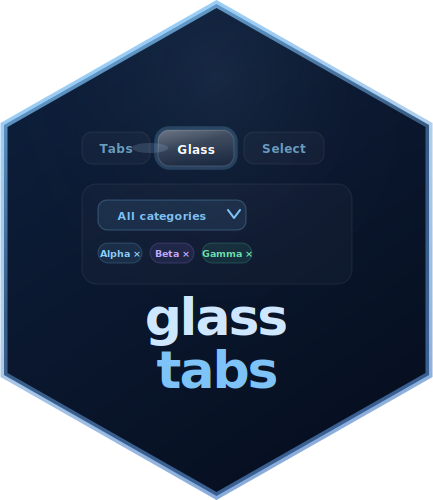

# glasstabs 

> Animated glass-morphism tab navigation and multi-select filter widgets for R Shiny

<!-- badges: start -->
[](https://CRAN.R-project.org/package=glasstabs)
[](https://github.com/prigasG/glasstabs/actions/workflows/R-CMD-check.yaml)
<!-- badges: end -->

---

## Overview

**glasstabs** provides animated Shiny widgets built around a glass-morphism aesthetic:

- **`glassTabsUI()`** — an animated tab bar with a sliding glass halo that follows the active tab
- **`glassMultiSelect()`** — a multi-select dropdown with three selection styles, live search, tag-pill syncing, and server-side update support
- **`glassSelect()`** — an animated single-select dropdown with optional search, clear support, theming, selection styles, and server-side update support

All widgets are self-contained, fully themeable, and work in plain `fluidPage()`, `bs4DashPage()`, or any other Shiny page wrapper.

**Full documentation:** <https://prigasg.github.io/glasstabs/>

---

## Installation

```r
# From CRAN
install.packages("glasstabs")

# From GitHub (development version)
pak::pak("prigasG/glasstabs")
# or
devtools::install_github("prigasG/glasstabs")
```

---

## Quick start

```r
library(shiny)
library(glasstabs)

ui <- fluidPage(
  useGlassTabs(),
  glassTabsUI(
    "main",
    glassTabPanel(
      "t1", "Overview", selected = TRUE,
      h3("Overview"),
      p("Content here."),
      glassFilterTags("cat")
    ),
    glassTabPanel(
      "t2", "Details",
      h3("Details"),
      p("More content."),
      glassFilterTags("cat")
    ),
    extra_ui = glassMultiSelect(
      "cat",
      c(A = "a", B = "b", C = "c"),
      show_style_switcher = FALSE
    )
  ),
  verbatimTextOutput("info")
)

server <- function(input, output, session) {
  tabs <- glassTabsServer("main")
  filt <- glassMultiSelectValue(input, "cat")

  output$info <- renderPrint({
    list(
      active_tab = tabs(),
      selected = filt$selected(),
      style = filt$style()
    )
  })
}

shinyApp(ui, server)
```

> **Note:** `useGlassTabs()` must be called once somewhere in the UI before any `glassTabsUI()` or `glassMultiSelect()` call. It injects the shared CSS and JavaScript as a properly deduplicated `htmltools` dependency.

---

## Function reference

### Setup

| Function | Description |
|---|---|
| `useGlassTabs()` | Inject package CSS and JavaScript — call once in the UI |
| `runGlassExample(example)` | Launch a built-in example app (`runGlassExample()` to list all) |

### Tab widget

| Function | Description |
|---|---|
| `glassTabsUI(id, ..., selected, wrap, extra_ui, theme)` | Animated tab bar with content area |
| `glassTabPanel(value, label, ..., icon, selected)` | Define one tab and its content; `icon` accepts `shiny::icon()` |
| `glassTabsServer(id, bookmark)` | Reactive returning the active tab; bookmarks active tab in URL |
| `glassTabsOutput(outputId)` | UI placeholder for a server-rendered tab widget |
| `renderGlassTabs({expr})` | Render a `glassTabsUI()` reactively; JS reinitialises automatically |
| `updateGlassTabsUI(session, id, selected)` | Switch the active tab from the server |
| `updateGlassTabBadge(session, id, value, count)` | Set a numeric badge on a tab button (`0` hides it) |
| `showGlassTab(session, id, value)` | Show a hidden tab |
| `hideGlassTab(session, id, value)` | Hide a tab from the navigation bar |
| `disableGlassTab(session, id, value)` | Gray out a tab (stays visible, not clickable) |
| `enableGlassTab(session, id, value)` | Re-enable a disabled tab |
| `appendGlassTab(session, id, tab, select)` | Add a new tab at runtime |
| `removeGlassTab(session, id, value)` | Remove a tab at runtime |
| `glass_tab_theme(...)` | Custom colour theme for `glassTabsUI()` |

### Select widgets

| Function | Description |
|---|---|
| `glassMultiSelect(inputId, choices, ...)` | Multi-select dropdown widget |
| `updateGlassMultiSelect(session, inputId, ...)` | Update multi-select choices, selection, or style |
| `glassMultiSelectValue(input, inputId)` | Reactive helper for multi-select value and style |
| `glassSelect(inputId, choices, ...)` | Single-select dropdown widget |
| `updateGlassSelect(session, inputId, ...)` | Update single-select choices, selection, or style |
| `glassSelectValue(input, inputId)` | Reactive helper for selected value |
| `glassFilterTags(inputId)` | Tag-pill display area synced to a multi-select |
| `glass_select_theme(...)` | Custom colour theme for `glassSelect()` and `glassMultiSelect()` |

---

## Shiny inputs

| Input | Type | Description |
|---|---|---|
| `input[["<id>-active_tab"]]` | `character` | Currently active tab value from `glassTabsUI()` |
| `input$<inputId>` | `character vector` | Selected values from `glassMultiSelect()` |
| `input$<inputId>_style` | `character` | Active selection style from `glassMultiSelect()` |
| `input$<inputId>` | `character` or `NULL` | Selected value from `glassSelect()` |

---


## Multi-select example

```r
library(shiny)
library(glasstabs)

choices <- c(
  Apple  = "apple",
  Banana = "banana",
  Cherry = "cherry"
)

ui <- fluidPage(
  useGlassTabs(),
  glassMultiSelect("fruit", choices),
  glassFilterTags("fruit"),
  verbatimTextOutput("out")
)

server <- function(input, output, session) {
  output$out <- renderPrint(input$fruit)
}

shinyApp(ui, server)
```

> **Note:** By default, `glassMultiSelect()` starts with all choices selected.

## Server-side updates

```r
server <- function(input, output, session) {
  observeEvent(input$clear, {
    updateGlassMultiSelect(
      session,
      "fruit",
      selected = character(0)
    )
  })

  observeEvent(input$fill_style, {
    updateGlassMultiSelect(
      session,
      "fruit",
      check_style = "filled"
    )
  })
}

```

---


## Single-select example

```{r single-select}
library(shiny)
library(glasstabs)

choices <- c(
  North = "north",
  South = "south",
  East  = "east",
  West  = "west"
)

ui <- fluidPage(
  useGlassTabs(),
  glassSelect(
    "region",
    choices,
    clearable = TRUE,
    check_style = "checkbox",
    theme = "light"
  ),
  verbatimTextOutput("out")
)

server <- function(input, output, session) {
  output$out <- renderPrint(input$region)
}

shinyApp(ui, server)
```

## Server-side updates

```r
server <- function(input, output, session) {
  observeEvent(input$pick_south, {
    updateGlassSelect(
      session,
      "region",
      selected = "south"
    )
  })

  observeEvent(input$clear_region, {
    updateGlassSelect(
      session,
      "region",
      selected = character(0)
    )
  })
  
  observeEvent(input$fill_region, {
  updateGlassSelect(
    session,
    "region",
    check_style = "filled"
  )
})
}
```

---

## Theming

All widgets default to `"dark"`. You can switch to `"light"` or supply a custom theme object.

```r
# Tab widget
glassTabsUI(
  "nav",
  glassTabPanel("a", "A", selected = TRUE, p("Content")),
  theme = glass_tab_theme(
    halo_bg = "rgba(251,191,36,0.15)",
    tab_active_text = "#fef3c7"
  )
)

# Multi-select
glassMultiSelect(
  "filter", choices,
  theme = glass_select_theme(
    mode = "dark",
    accent_color = "#f59e0b"
  )
)

# Single-select
glassSelect(
  "region", choices,
  theme = glass_select_theme(
    mode = "light",
    accent_color = "#2563eb"
  )
)

# Built-in light preset
glassTabsUI("nav", theme = "light", ...)
glassMultiSelect("f", choices, theme = "light", ...)
glassSelect("s", choices, theme = "light", ...)
```

### `glass_tab_theme()` handles

| Argument | Controls |
|---|---|
| `tab_text` | Inactive tab label color |
| `tab_active_text` | Active tab label color |
| `halo_bg` | Sliding glass halo fill |
| `halo_border` | Sliding glass halo border |
| `content_bg` | Tab content panel background |
| `content_border` | Tab content panel border |
| `card_bg` | Inner card background |
| `card_text` | Inner card text color |

### `glass_select_theme()` handles

| Argument | Controls |
|---|---|
| `mode` | Base preset, either `"dark"` or `"light"` |
| `bg_color` | Dropdown panel and trigger background |
| `border_color` | Border color |
| `text_color` | Main text color |
| `accent_color` | Ticks, badges, checked states, and clear controls |
| `label_color` | Optional field label color |

---

## Checkbox styles

`glassMultiSelect()` and `glassSelect()` support three selection indicator styles:

| Style | Appearance |
|---|---|
| `"checkbox"` | Ghost box with animated tick |
| `"check-only"` | Tick only, no box |
| `"filled"` | Solid colored box with no tick |

```r
glassMultiSelect(
  "f", choices,
  check_style = "filled",
  show_style_switcher = FALSE
)

glassSelect(
  "s", choices,
  check_style = "check-only"
)
```

Hues distribute automatically around the color wheel or can be set manually under multi-select:

```r
glassMultiSelect("f", c(Apple = "apple", Banana = "banana", Cherry = "cherry"),
  check_style = "filled",
  hues = c(apple = 10L, banana = 50L, cherry = 340L)
)
```

---

## bs4Dash compatibility

Pass `wrap = FALSE` when embedding inside a bs4Dash card.

```r
bs4Card(
  glassTabsUI("dash",
    wrap     = FALSE,
    theme    = "light",
    extra_ui = glassMultiSelect("f", choices, theme = "light"),
    glassTabPanel("a", "Overview", selected = TRUE, p("Content")),
    glassTabPanel("b", "Details",  p("More"))
  )
)
```

---

## Multiple instances

Multiple `glassTabsUI()` and `glassMultiSelect()` widgets on the same page work independently — each is scoped by its `id`, so CSS variables and JS event handlers never bleed across instances.

---

## Articles

Full vignettes are available on the documentation site:

| Article | Description |
|---|---|
| [Cheatsheet](https://prigasg.github.io/glasstabs/articles/cheatsheet.html) | Quick reference for tabs, selects, updates, and server helpers |
| [Getting started](https://prigasg.github.io/glasstabs/articles/getting-started.html) | Progressive walkthrough of both widgets |
| [Animated tabs](https://prigasg.github.io/glasstabs/articles/tabs.html) | Full `glassTabsUI()` reference with theming and bs4Dash |
| [Multi-select filter](https://prigasg.github.io/glasstabs/articles/multiselect.html) | Full `glassMultiSelect()` reference with styles, tags and updates |
| [Single-select filter](https://prigasg.github.io/glasstabs/articles/glassSelect.html) | Full `glassSelect()` reference with search, clear, and updates |

---

## Server-side tab control

```r
server <- function(input, output, session) {
  # Switch to a tab programmatically
  observeEvent(input$next_btn, {
    updateGlassTabsUI(session, "tabs", selected = "details")
  })

  # Show/hide tabs conditionally
  observeEvent(input$is_admin, {
    if (input$is_admin) showGlassTab(session, "tabs", "admin")
    else                hideGlassTab(session, "tabs", "admin")
  }, ignoreInit = FALSE)

  # Add and remove tabs dynamically
  observeEvent(input$add_tab, {
    appendGlassTab(session, "tabs",
      glassTabPanel("dynamic", "Dynamic", p("Added at runtime")),
      select = TRUE
    )
  })

  observeEvent(input$remove_tab, {
    removeGlassTab(session, "tabs", "dynamic")
  })
}
```

---

## What's new in 0.3.0

- `runGlassExample()` — launch any built-in example from the console
- `icon` argument in `glassTabPanel()` — add `shiny::icon()` or any tag to a tab button
- `disableGlassTab()` / `enableGlassTab()` — gray out tabs without hiding them
- `updateGlassTabBadge()` — set live numeric count badges on tab buttons
- `glassTabsServer(bookmark = TRUE)` — active tab preserved in Shiny URL bookmarks
- `glassTabsOutput()` / `renderGlassTabs()` — fully server-driven reactive tab sets
- `inst/cheatsheet/glasstabs-cheatsheet.tex` — printable two-column LaTeX reference card

---

## License

MIT (c) glasstabs authors
